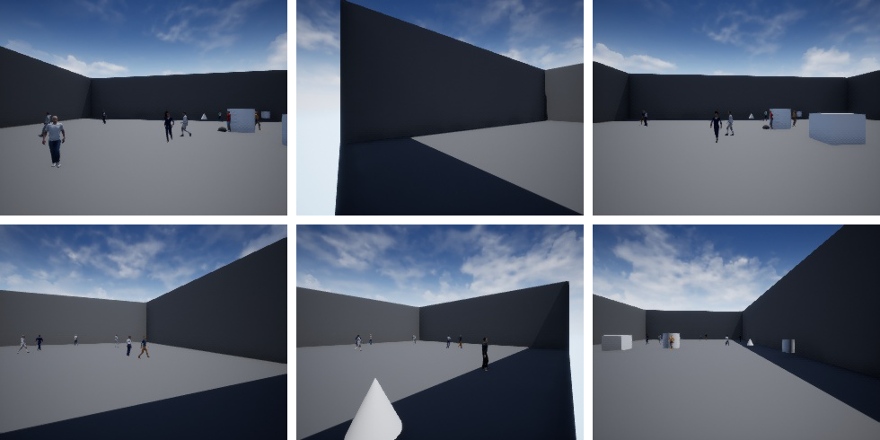

# Active Object Tracking with Occluded Targets Estimation and Adversarial Reinforcement Learning
This repository is the python implementation of Active Object Tracking with Occluded Targets Estimation and Adversarial Reinforcement Learning.

## 3D Environments
The 3D environment diagram used in our method includes `6` cameras and `10` movable targets.

We integrate our custom UE4 environment with reinforcement learning using [gym-unrealcv](https://github.com/zfw1226/gym-unrealcv). After completing the installation according to the method provided in [gym-unrealcv](https://github.com/zfw1226/gym-unrealcv), add the contents from the `gym_unrealcv` of this project. Since the virtual environment occupies a large amount of space, we provide a download link in the `gym_unrealcv\envs\UnrealEnv`. Please download it and place it in this directory.

## Training
| ENV_NAME | MODULE | TARGET_TRAIN | 
|:-----:|:-----:|:-----:|
| UnrealMTMC18v3-DiscreteColorGoal-v1 | GT | FALSE |
| UnrealMTMC18v3-DiscreteColorGoal-v2 | MOT | FALSE |
| UnrealMTMC18v3-DiscreteColorGoal-v3 | MOT | TRUE |
| UnrealMTMC18v3-DiscreteColorGoal-v4 | MOT+Predict | FALSE |
| UnrealMTMC18v3-DiscreteColorGoal-v5 | MOT+Predict | TRUE |

You can use the following command:
```
python3 src/main.py --config=iql with use_tensorboard=True save_model=True env_id=ENV_NAME t_max=400000
```

## Evaluation
After training the model, you can test the effect of each module. You can use the following command:

```
python3 src/main.py --config=iql with use_tensorboard=True save_model=True env_id=ENV_NAME eps_time=0 test_nepisode=32 checkpoint_path=CHECKPOINT_PATH evaluate=True
```

## Citation
